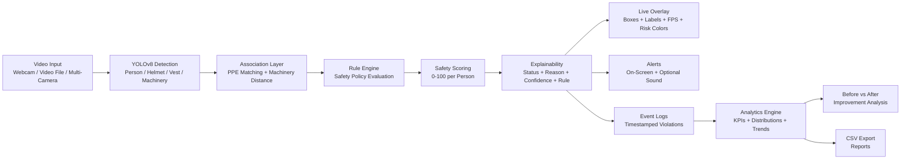

# AI-Powered Real-Time Workplace Safety Monitoring & Analytics System

Production-ready AI platform for monitoring worker safety in live video streams.

The system does not stop at object detection. It adds deterministic safety reasoning,
person-level scoring, explainable outputs, alerts, and analytics for operational decisions.

## Project Idea

This project works as a digital safety supervisor:

1. Detect workers and PPE in real time.
2. Evaluate safety policy using explicit rules.
3. Explain every decision in plain language.
4. Trigger alerts for high-risk situations.
5. Track trends and compliance improvements over time.

## What Makes It Unique

1. Vision + Rule Intelligence
	YOLOv8 detects objects, then a transparent rule engine evaluates workplace safety logic.

2. Dynamic Safety Score per Person
	Each worker gets a live score from 0-100 using PPE + machinery distance context.

3. Explainable AI Decisions
	Every assessment includes status, reason, confidence, and triggered rule ID.

4. Multi-Camera Aggregation
	Supports webcam, video input, and simulated multi-feed monitoring with unified analytics.

5. Before vs After Analytics
	Compares safety metrics across sessions to show measurable improvement.

## End-to-End Flowchart



## Rule-Based Safety Logic

1. If person detected and helmet missing -> Unsafe (High Risk)
2. If vest missing -> Warning
3. If person too close to machinery -> Dangerous
4. If PPE complete and safe distance maintained -> Safe

Each rule result is logged with reasoning and confidence context.

## Safety Scoring Model

- Helmet: +40
- Vest: +30
- Safe machinery distance: +30
- Rule violations apply penalties
- Final score is clamped to 0-100

Risk levels:

- Green: Safe
- Yellow: Warning
- Red: Danger

## Current Module Map

- core: detection, association, rules, scoring, explainability, pipeline orchestration, overlays
- video: webcam/file/multi-camera source adapters
- alerts: visual and optional sound alert manager
- analytics: KPI aggregation, trends, before-vs-after comparison
- storage: violation event logger and analytics CSV export
- ui: dashboard chart builders
- training: YOLO dataset structure and training/evaluation guide

## Run Locally

1. Install dependencies

```bash
pip install -r requirements.txt
```

2. Start Streamlit app

```bash
streamlit run main.py
```

This project includes `.streamlit/config.toml` with `fileWatcherType = "none"` to avoid
PyTorch class-path inspection warnings on some Windows setups.

## Deploy to Streamlit Cloud

This project is configured for seamless deployment to [Streamlit Cloud](https://streamlit.io/cloud):

1. **Push repository to GitHub**
	- Ensure all files including `requirements.txt`, `packages.txt`, and `.streamlit/config.toml` are committed

2. **Deploy via Streamlit Cloud**
	- Go to https://share.streamlit.io/
	- Connect your GitHub repository
	- Select the repository and branch
	- Click "Deploy"

3. **Configuration Files Used**
	- `requirements.txt`: Python dependencies (uses `opencv-python-headless` for headless environments)
	- `packages.txt`: System-level dependencies for OpenCV (libsm6, libxext6, libgl1-mesa-glx, etc.)
	- `.streamlit/config.toml`: Optimized settings for Cloud deployment
	- `runtime.txt`: Specifies Python version (3.12)

**Note:** The app uses headless mode on the cloud, so webcam input will only work when users upload video files or the system accesses video URLs via network streams.

3. In the sidebar

- Select input mode: Webcam, Video File, or Multi-Camera Simulation
- Set YOLO model path
- Tune confidence/IoU thresholds
- Start monitoring

## Data, Training, and Evaluation

- Dataset format and template are under training/
- Use Ultralytics YOLO training flow with augmentation
- Track mAP50-95, precision, and recall during validation

See training/README.md for full steps.

## Logs and Exports

- Violation logs: results/violations_log.csv
- Analytics summary export: results/analytics_summary.csv

## Notes

- For accurate helmet and vest detection, use a PPE-trained YOLO model.
- Default runtime model path is configurable in config.py.
- Streamlit Cloud deployment uses `runtime.txt` to pin Python 3.11. This avoids binary wheel issues on newer Python versions.
- Server deployments should use `opencv-python-headless` (already set in `requirements.txt`) instead of GUI OpenCV packages.
